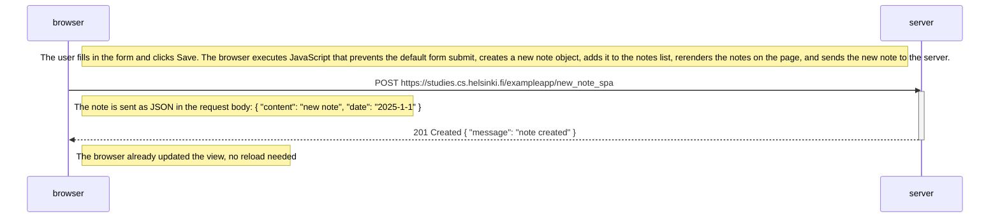

# 0.6: New note in Single page app diagram

Sequence diagram depicting when a user creates a new note using the single-page version of the app.

```mermaid
sequenceDiagram
    participant browser
    participant server

    Note right of browser: The user fills in the form and clicks Save. The browser executes JavaScript that prevents the default form submit, creates a new note object, adds it to the notes list, rerenders the notes on the page, and sends the new note to the server.

    browser->>server: POST https://studies.cs.helsinki.fi/exampleapp/new_note_spa
    activate server
    Note right of browser: The note is sent as JSON in the request body: { "content": "new note", "date": "2025-1-1" }
    server-->>browser: 201 Created { "message": "note created" }
    deactivate server

    Note right of browser: The browser already updated the view, no reload needed
```
